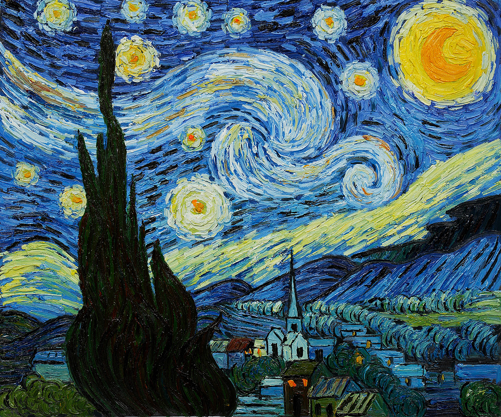
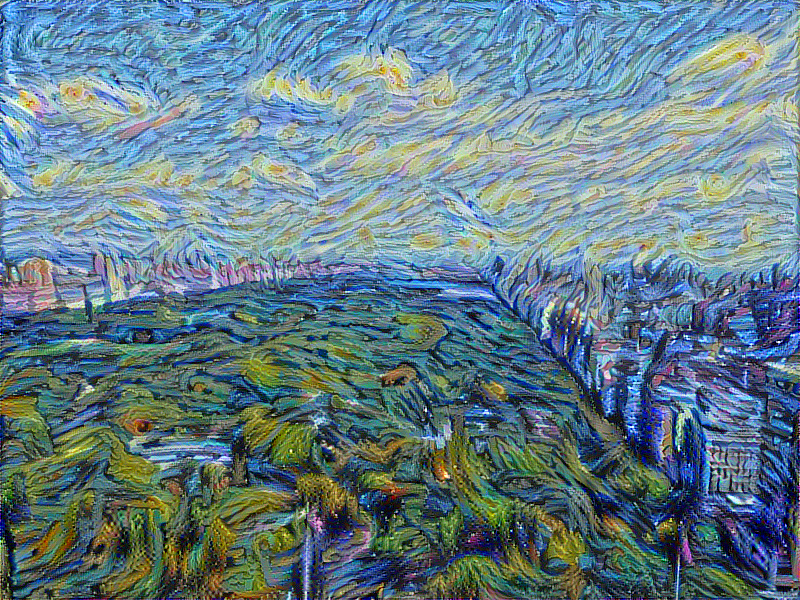
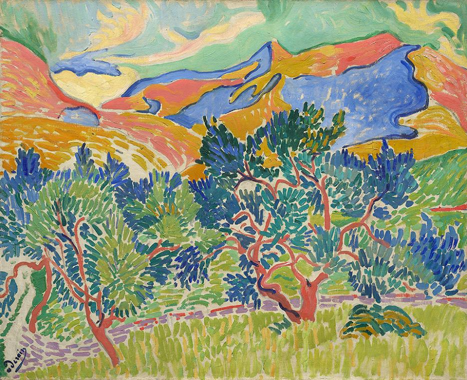
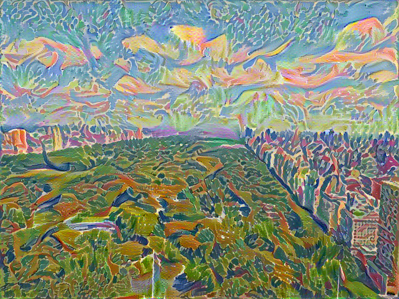
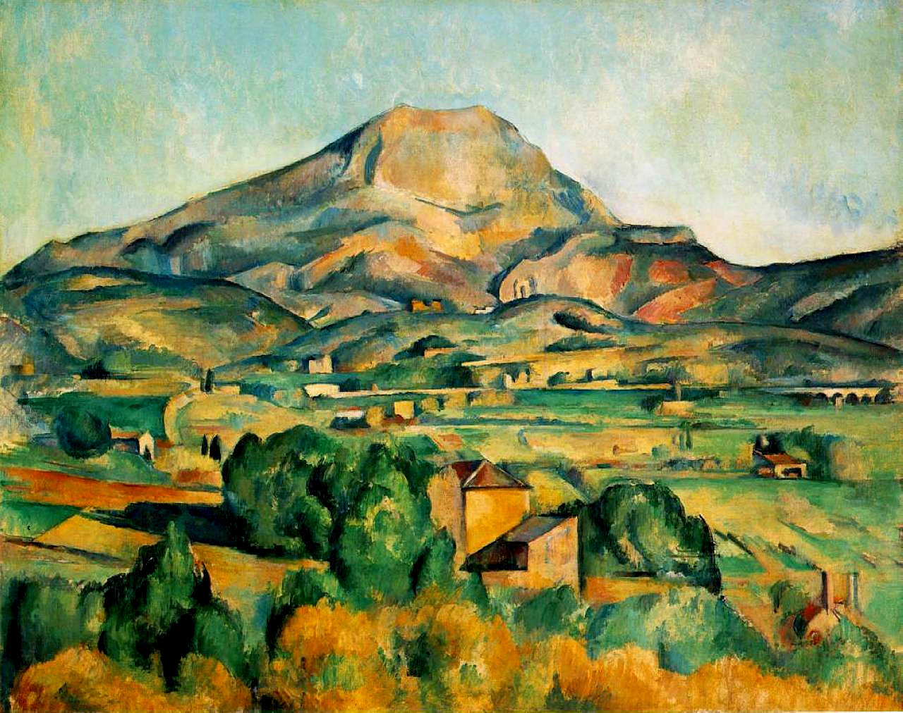
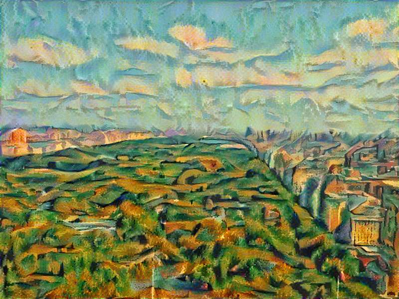
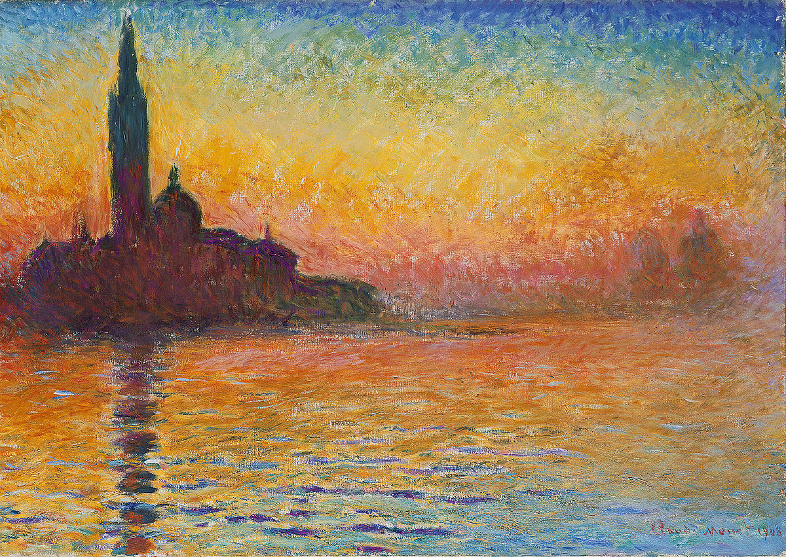
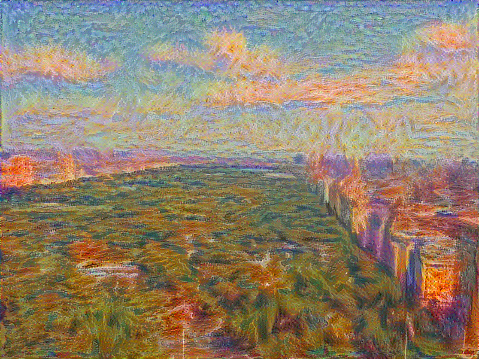

# TensorFlow implementation of "A Neural Algorithm of Artistic Style"

Gatys et al., in their 2015 [paper](https://arxiv.org/pdf/1508.06576v2.pdf) allow us to do a bit of time travelling and invite our favorite artists to paint a scenery we love or portraits of family members.
They showed that we could use Convolution Neural Networks to mix the content of an image with the style of another.

Here is a TensorFlow implementation of the article. We used the style of famous masterpieces from Van Gogh (Starry Night), Cezanne (Mont Sainte-Victoire), Derain (Montagnes a Collioure) and Monet (Saint-Georges-Majeur au crépuscule) and mixed it on a photo of a Central Park taken from the 36th floor of the Sollow building in Manhattan (9 West 57th Street).

# Requirements: 
- TensorFlow
- NumPy
- SciPy
- Pillow
- I used a p2.xlarge GPU instance from AWS

# Method:

Gatsys et al. first remark that the feature maps of images, the filter responses, are focus more and more on the actual content of the image rather than its detailed pixel values as we go into the deeper layers. 

To obtain the style of an image, we need to compute the correlation between the filter responses of the feature maps. The feature correlations of multiple layers give a multi-scale representation of the input image which captures the texture but not the arrangement of objects on the image.

VGG19 has 16 convolution layers and 5 average pooling layers. 

Using the original Central Park image, we compute the feature maps of the 14th convolution layer. Using a style image, we compute the correlation of the feature maps over the layers 1, 3, 5, 9 and 13 with more weights on the deeper layers.

We then modify a noise image (actually 60% noise and 40% style image) using gradient descent so that its feature maps of the 14th convolution layers matches the content image's maps and at the same time that it's correlations matches the correlations of the style image. 

## Original image of Central Park

## Van Gogh's style

## Derain's style

## Cezanne's style

## Monet's style

