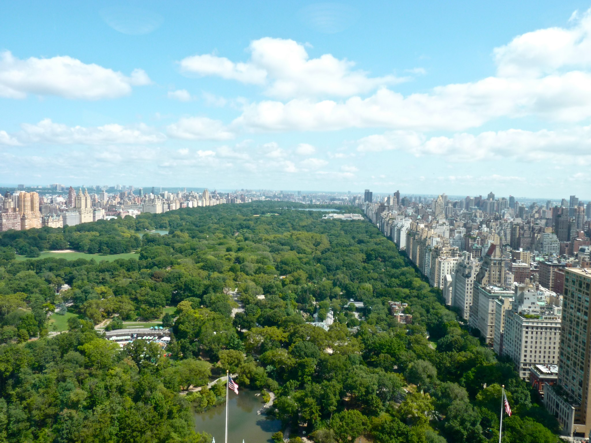

# TensorFlow implementation of "A Neural Algorithm of Artistic Style"

Gatys et al., in their 2015  allow us to do a bit of time travelling and invite our favorite artists to paint a scenery we love or portraits of family members.
They showed that we could use Convolution Neural Networks to mix the content of an image with the style of another.

Here is a TensorFlow implementation of the article. We used the style of famous masterpieces from Van Gogh, Cezanne, Matisse and Monet and mixed it on a photo of a Central Park taken from the 36th floor of the Sollow building in Manhattan (9 W 57th Street).

Requirements: 
- Python 3.5
- TensorFlow
- I used a p2.xlarge instance from AWS with GPU (highly recommended)

They used the pretrained VGG-Network CNN, its 16 convolutional and 5 pooling layers.
Reconstruction of the content image: lower layers simply reproduce the exact pixel values of the original image. Higher layers in the network capture the high level content in terms of objects and their arrangement in the input image. Hence we use the 4th convolution layer
To extract the style of an image, we compute the correlations between the different filter responses over the multiple layers. We obtain a multi-scale representation that captures the texture but not the arrangement of objects.
